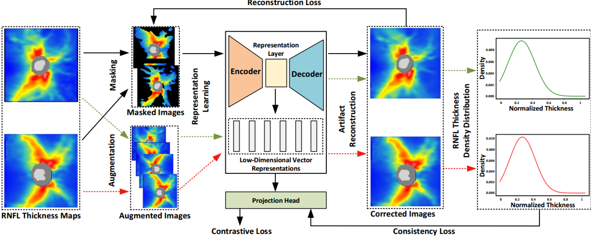
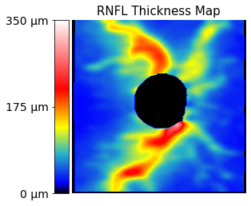
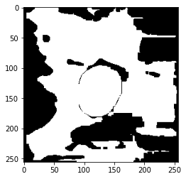
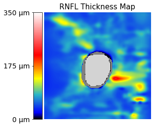

# RNFLT2Vec

The dataset and code for the paper entitled [**RNFLT2Vec: Artifact-Corrected Representation Learning for Retinal Nerve Fiber Layer Thickness Maps**](https://doi.org/10.1016/j.media.2024.103110) published in the Medical Image Analysis.



## Requirements
Python 3.8 <br/>
tensorflow 2.4.0 <br/>
opencv-python 4.5.5

## Dataset

Here are sample codes to visualize the RNFLT map:
````
from utils.map_handler import *
import matplotlib.pyplot as plt

rnflts = np.load('dataset/samples.npy')
img = rnflts[0]
plot_2dmap(img, show_cup=True)
````


Calculate the masked RNFLT and corresponding mask image:
````
# RNTLT values less than the cutoff are treated as artifacts
masked_map, ori_mask, resized_map = process(img, cutoff=50)

plt.imshow(masked_map)
plt.show()
plt.imshow(ori_mask)
````



## Pretrained Model
The model weight "EyeLearn_weights.72-0.0019.h5" trained using 10,000 samples from our larger private dataset can be downloaded via this [link](https://ophai.hms.harvard.edu/datasets/harvard-gd500/)


## Use the Model
````
from models import rnflt2vec

# load the pretrained model
rnflt2vec = rnflt2vec.construct_model_from_args(args)
rnflt2vec.load('combined_rnflt2vec_weights_512_128_10_0001_004.93-0.03', train_bn=False, lr=0.00005)

# embedding learning model
encoder = rnflt2vec.model.get_layer('embed_model')
model_embed = Model(inputs=encoder.inputs, 
                    outputs=encoder.get_layer('encoder_output').output)
                    
# artifact correction model                   
rnflt2vec_inpaint_model = rnflt2vec.model.get_layer('inpaint_model')
model_correction = Model(inputs=RNFLT2Vec_inpaint_model.inputs, outputs=RNFLT2Vec_inpaint_model.outputs)
                                 
# embedding inference
embeds = model_embed.predict([masked_map, ori_mask])[0] 
# artifact correction
preds = model_correction.predict([masked_map, ori_mask])[0]
````

#### Artifact correction examples: <br />


## Acknowledgement & Citation


If you find this repository useful for your research, please consider citing our [paper](https://ieeexplore.ieee.org/abstract/document/10159482):

```bibtex
@article{shi2024rnflt2vec,
  title={RNFLT2Vec: Artifact-corrected representation learning for retinal nerve fiber layer thickness maps},
  author={Shi, Min and Tian, Yu and Luo, Yan and Elze, Tobias and Wang, Mengyu},
  journal={Medical Image Analysis},
  pages={103110},
  year={2024},
  publisher={Elsevier}
}

